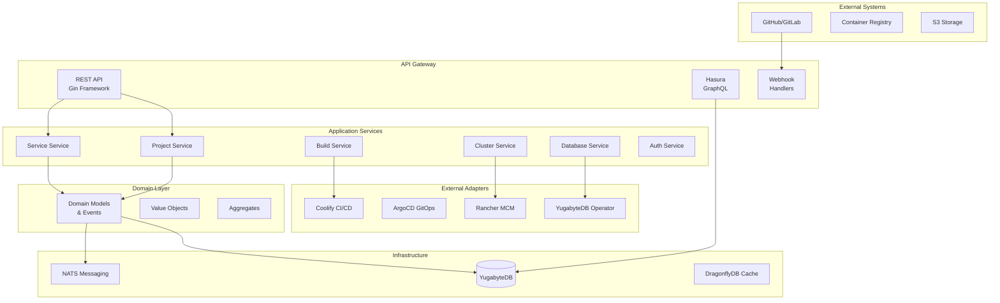
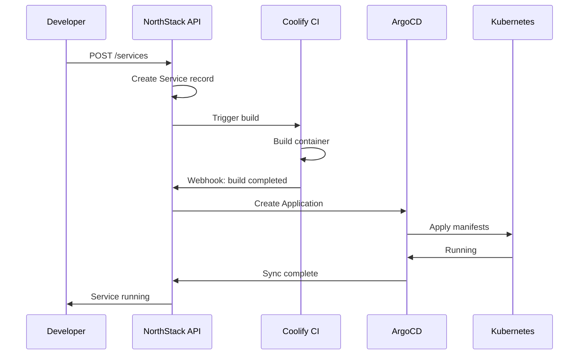
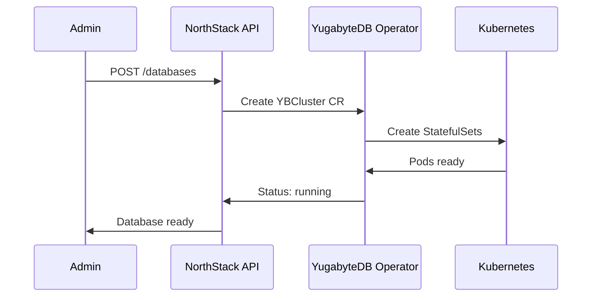
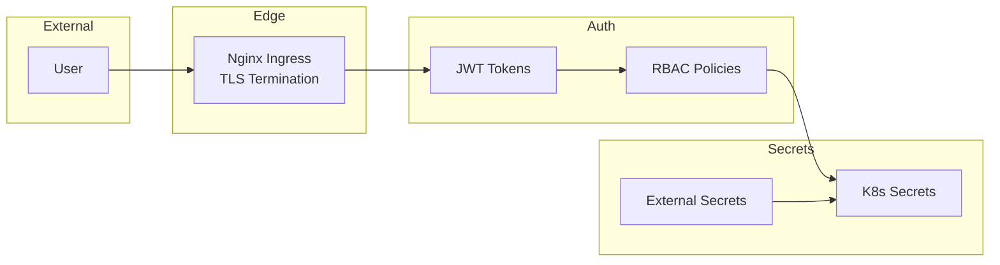

# NorthStack Platform - Architecture Document

**Version:** 1.0  
**Date:** January 16, 2026

---

## 1. System Overview

NorthStack is built on **Domain-Driven Design (DDD)** principles with a clean architecture separating:
- **Domain Layer** - Core business logic
- **Application Layer** - Use cases and orchestration
- **Infrastructure Layer** - External integrations
- **Presentation Layer** - API handlers

---

## 2. High-Level Architecture

---

## 3. Component Details

### 3.1 API Layer

| Component | Technology | Purpose |
|-----------|------------|---------|
| REST API | Gin (Go) | Primary CRUD operations |
| GraphQL | Hasura | Real-time subscriptions |
| Webhooks | Custom handlers | GitHub/CI events |

### 3.2 Domain Models

| Entity | Description | Key Fields |
|--------|-------------|------------|
| Project | Container for services | name, slug, owner_id |
| Service | Deployable unit | type, status, build_source |
| Build | CI/CD pipeline run | status, commit_sha, logs |
| Deployment | Running instance | environment, replicas |
| Cluster | Kubernetes cluster | provider, region, nodes |
| User | Platform user | email, role, team |

### 3.3 Value Objects

| Value Object | Validation |
|--------------|------------|
| Email | RFC 5322 format |
| Slug | lowercase, hyphens only |
| Port | 1-65535 |
| Namespace | K8s naming rules |
| ResourceLimits | CPU/memory constraints |

### 3.4 Domain Events

| Event | Trigger |
|-------|---------|
| ProjectCreated | New project created |
| ServiceDeployed | Service deployed |
| BuildCompleted | Build finished |
| DatabaseCreated | New DB provisioned |
| ClusterProvisioned | Cluster ready |

---

## 4. Data Flow

### 4.1 Service Deployment Flow

### 4.2 Database Provisioning Flow

---

## 5. Security Architecture

### Security Measures

| Layer | Measure |
|-------|---------|
| Network | TLS 1.3, mTLS between services |
| Auth | JWT with refresh tokens |
| Authorization | RBAC with roles |
| Secrets | External Secrets Operator |
| Scanning | Trivy in CI pipeline |
| Audit | Full audit logging |

---

## 6. Deployment Architecture

### 6.1 Kubernetes Resources

| Resource | Replicas | HPA | PDB |
|----------|----------|-----|-----|
| API Server | 3 | Yes (70% CPU) | min 2 |
| Hasura | 2 | Yes (70% CPU) | min 1 |
| NATS | 3 | No | min 2 |
| YugabyteDB TServer | 3 | No | min 2 |
| YugabyteDB Master | 3 | No | min 2 |

### 6.2 Resource Limits

| Service | CPU Req | CPU Limit | Mem Req | Mem Limit |
|---------|---------|-----------|---------|-----------|
| API Server | 250m | 1 | 256Mi | 512Mi |
| Hasura | 500m | 2 | 512Mi | 2Gi |
| YB TServer | 2 | 4 | 4Gi | 8Gi |
| YB Master | 1 | 2 | 2Gi | 4Gi |

---

## 7. Technology Stack

| Layer | Technology |
|-------|------------|
| Language | Go 1.21+ |
| Framework | Gin |
| Database | YugabyteDB |
| Cache | DragonflyDB |
| Messaging | NATS |
| GraphQL | Hasura |
| CI/CD | Coolify, ArgoCD |
| Kubernetes | Rancher, RKE2 |
| Monitoring | Prometheus, Grafana |
| Logging | Loki |
